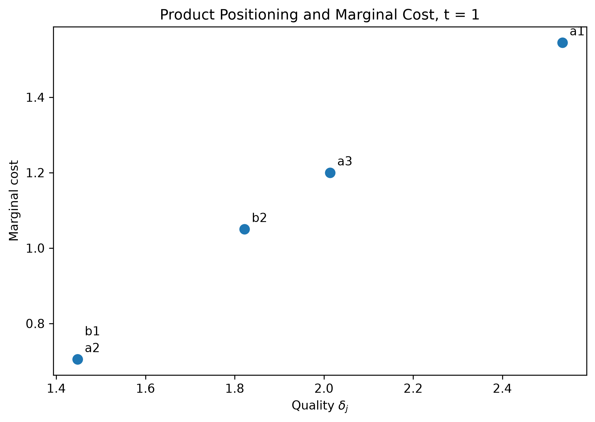
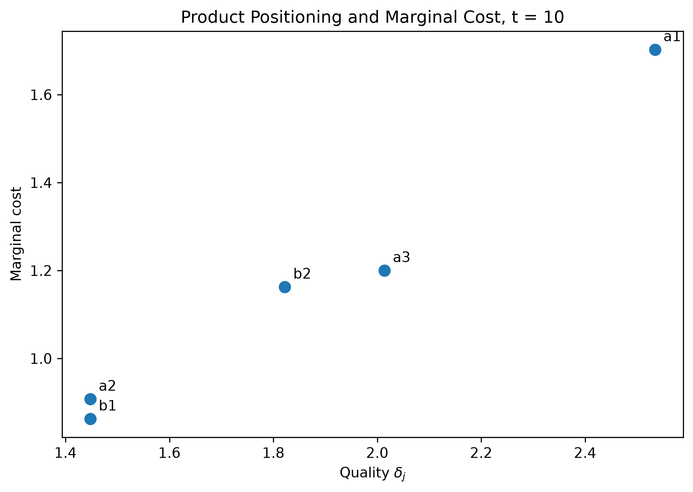

<!--
Render this document from the repository root with:

    quarto render pset_1/pset_1_submission.qmd --to pdf

The resulting PDF is written next to this file.
-->

# I. Conduct analysis in the product space: a monopsonist firm?

## Part 1: theory and DGP

### i. Solving for the equilibria

In scenario 1, the firm solves
$$
  \max_{L_t} p_t e^{\nu_t} L_t^\beta - w_t L_t,  
$$
with FOC
$$
  w_t = \beta\, p_t e^{\nu_t} L_t^{\beta - 1},
$$
which is the labor demand equation in this case. In scenario 2, where the firm knows it will affect wages, we also have to incorporate the $\partial w_t/\partial L_t$ term from the labor supply. The FOC in scenario 2 is
$$
  \beta\, p_t e^{\nu_t} L_t^{\beta - 1} = w_t + L_t\,\frac{\partial w_t}{\partial L_t}.
$$
We can already see that wages will be lower in this case. Because labor supply is upward-sloping in wages, the equation above will yield the wages of scenario 1 minus a positive term. Taking logs in the labor supply equation, we get
$$
\log (L_t) = \alpha + \gamma \log (w_t) + \mu \log (u_t) + \rho \log (u_t) \log (w_t) + \eta_t.
$$
This makes it easy to calculate the labor supply elasticity
$$
\frac{\partial\log(L_t)}{\partial\log(w_t)} = \frac{w_t}{L_t}\,\frac{\partial L_t}{\partial w_t} = \gamma + \rho \log(u_t).
$$
By the inverse function theorem,
$$
\frac{\partial\log(w_t)}{\partial\log(L_t)} = \frac{L_t}{w_t}\,\frac{\partial w_t}{\partial L_t} = \frac{1}{\gamma + \rho \log(u_t)}.
$$
Dividing both sides of the scenario 2 labor demand equation by $w_t$,
$$
  \frac{\beta\, p_t e^{\nu_t} L_t^{\beta - 1}}{w_t} = 1 + \frac{L_t}{w_t}\,\frac{\partial w_t}{\partial L_t} = 1 + \frac{1}{\gamma + \rho \log(u_t)}.
$$
Solving for $w_t$,
$$
w_t = \beta\,p_t e^{\nu_t} L_t^{\beta - 1} \tag{Scenario 1 Labor Demand}
$$
$$
w_t = \left(1 + \frac{1}{\gamma + \rho \log(u_t)}\right)^{-1} \beta\, p_t e^{\nu_t} L_t^{\beta - 1} \tag{Scenario 2 Labor Demand}.
$$
We can combine both by defining the markdown
$$
M = \begin{cases}
1, &\text{in Scenario 1}\\
\left(1 + \dfrac{1}{\gamma + \rho \log(u_t)}\right)^{-1}, &\text{in Scenario 2}
\end{cases}.
$$
Then, in both cases, labor market equilibrium $(L_t, w_t)$ is determined by both labor supply and demand, so by the system
$$
\begin{cases}
w_t = \beta\,M\, p_t e^{\nu_t} L_t^{\beta - 1}\\[0.5em]
L_t = \exp\Big(\alpha + \gamma \log (w_t) + \mu \log(u_t) + \rho \log(u_t)\log(w_t) + \eta_t\Big)
\end{cases}.
$$
If we knew all the parameters $(\beta, \alpha, \gamma, \mu, \rho)$, and we observed $(p_t, u_t, \nu_t, \eta_t)$, we would also know $M$. Hence, the only unknowns in the two equations would be $(L_t, w_t)$. We could solve for them by hand by substituting $w_t$ from the labor demand into the labor supply equation, from which we could find a root $L_t^*$. Then, we just plug it into either equation to compute $w_t^*$.

#### 1. Wages in Scenario 1 vs. in Scenario 2

Because the markdown term $M$ lies in $(0,1)$, the labor demand curve is shifted down in Scenario 2. Therefore, equilibrium wages will be lower in Scenario 2.

#### 2. Markdown

By the markdown formula
$$
M = \left(1 + \dfrac{1}{\gamma + \rho \log(u_t)}\right)^{-1},
$$
$M$ is increasing in $\gamma$, in $\rho$, and does not depend on $\mu$. It is also increasing in $\u_t$. Because $M$ is a multiplier, $M$ becoming larger means that wages are being marked down less, hence higher. Here, we rely on $u_t > 1$ to avoid the logs being negative, so unemployment $u_t$ would be defined in absolute terms and not as a fraction.

\newpage

# II. Demand systems for bikes?

## Part 1: theory and DGP
### i. Derive expression for share of consumers

We use a McFadden style discrete choice setup. We assume that each consumer chooses exactly one of the five bikes, so there is no outside option, and add an i.i.d. Type I extreme value taste shock $\epsilon_{ij}$ to the utility given in the question:

$$
U_{ij}=\delta_j-\alpha_i p_j+\epsilon_{ij}, \qquad \delta_j=\exp(\beta_w w_j+\beta_g g_j),
$$
where
$$
\alpha_i\sim\operatorname{LogNormal}(\mu,1).
$$

The Type I extreme value assumption gives the standard conditional logit choice probability (McFadden, 1973， 1981). Conditional on $\alpha_i$,
$$
P_{ij}(\alpha_i)=\frac{\exp(\delta_j-\alpha_i p_j)}{\sum_{k\in\mathcal J}\exp(\delta_k-\alpha_i p_k)}.
$$

Because consumers differ in $\alpha_i$, aggregate demand is a mixed logit: we integrate the conditional choice probability over the distribution of $\alpha_i$. Since the total mass of consumers is normalized to one, the market share of product $j$ is also the fraction of consumers choosing $j$,
$$
s_j(\mathbf p)=\int_0^\infty P_{ij}(\alpha)f_\alpha(\alpha;\mu)\,d\alpha.
$$
Thus $\sum_j s_j=1$ under our NO outside option assumption (satisfies requirement of the problem). For numerical integration, we write
$$
\alpha_i=\exp(\mu+z_i), \qquad z_i\sim N(0,1).
$$
This is the same setup as the basic random coefficients logit structure commonly used in differentiated products demand models we've read about.

### ii. Bertrand-Nash price equilibrium

On the supply side, we assume a static multi product Bertrand-Nash game. Alan and Bianchi choose prices simultaneously, each taking the rival firm's prices as given. Product characteristics and marginal costs are taken as given, and each firm chooses the prices of all products it owns to maximize its total profit.

Alan owns $\mathcal J_A=\{a_1,a_2,a_3\}$ and Bianchi owns $\mathcal J_B=\{b_1,b_2\}$. Firm $f$'s profit in market $t$ is
$$
\pi_{ft}=\sum_{k\in\mathcal J_f}(p_{kt}-mc_{kt})s_{kt}(\mathbf p_t).
$$
Assuming an interior equilibrium and differentiable demand, the FOC for each $j\in\mathcal J_f$ is
$$
s_{jt}+\sum_{k\in\mathcal J_f}(p_{kt}-mc_{kt})\frac{\partial s_{kt}}{\partial p_{jt}}=0.
$$
To write these FOCs compactly, define the ownership matrix
$$
\Omega_{kj}
=
\begin{cases}
1, & \text{if products }k\text{ and }j\text{ are owned by the same firm},\\
0, & \text{otherwise}.
\end{cases}
$$
Here,

$$
\Omega
=
\begin{pmatrix}
1&1&1&0&0\\
1&1&1&0&0\\
1&1&1&0&0\\
0&0&0&1&1\\
0&0&0&1&1
\end{pmatrix}.
$$

Thus $\Omega$ simply tells the model which cross price effects a firm internalizes. Alan internalizes the effects of changing one Alan price on all three Alan products, while Bianchi does the same for its two products. Neither firm internalizes the effect of its pricing decision on the rival firm's profit.

We define
$$
D_t=\left[\frac{\partial s_{kt}}{\partial p_{jt}}\right]_{k,j}
$$

as the demand Jacobian. Then the five Bertrand first order conditions can be written as

$$
\mathbf s_t+(\Omega\circ D_t)'(\mathbf p_t-\mathbf{mc}_t)=\mathbf 0,
$$

where $\circ$ is the elementwise product. Defining

$$
\Delta_t=-(\Omega\circ D_t)',
$$

gives

$$
\mathbf s_t-\Delta_t(\mathbf p_t-\mathbf{mc}_t)=\mathbf 0.
$$

in terms of matrices notation.

If we assume $\Delta_t$ is invertible,

$$
\mathbf p_t-\mathbf{mc}_t=\Delta_t^{-1}\mathbf s_t.
$$

### iii. Product positioning and marginal costs

We interpret $w_t,g_t$ in the cost expression as the product characteristics $w_j,g_j$ from the table (or we simply assume $w_{tj}=w_j,g_{tj}=g_j$, so that bike characteristics are fixed over time).

From above, we measure product quality by the deterministic utility component

$$
\delta_j=\exp(\beta_w w_j+\beta_g g_j),
$$

and marginal cost is, as defined by the question,

$$
MC_{jt}=\gamma_w(1-w_j)c_t+\gamma_g g_j, \qquad c_t=0.5+\frac{t}{10}.
$$

Thus

$$
c_1=0.6, \qquad c_{10}=1.5.
$$

The plots for $t=1$ and $t=10$ follows:

{fig-cap="Product positioning and marginal costs at $t=1$." width=75%}

{fig-cap="Product positioning and marginal costs at $t=10$." width=75%}

Note that for $t=1$, $a_2$ and $b_1$ coincide as they have the same marginal cost. Also, we see that marginal cost rises over time for every product except $a_3$, because $w_{a_3}=1$ makes its carbon cost component equal to zero.

### iv. Brief comment on market shares and competition

Product characteristics, and therefore $\delta_j$, are fixed over time. The change in relative positioning therefore comes from marginal costs:

$$
\Delta MC_j=\gamma_w(1-w_j)(c_{10}-c_1)=0.225(1-w_j).
$$

Hence,

$$
(\Delta MC_{a_1},\Delta MC_{a_2},\Delta MC_{a_3},\Delta MC_{b_1},\Delta MC_{b_2})=(0.1575,0.2025,0,0.1575,0.1125).
$$

We therefore expect $a_3$ to gain market share because its marginal cost does not increase. $b_2$ should also gain relative to products whose costs rise more, while $a_2$, which has the largest cost increase, should lose.

The comparison between $a_2$ and $b_1$ is clear as they have identical quality (same value on x-axis), but by $t=10$,

$$
MC_{a_2,10}=0.9075>0.8625=MC_{b_1,10},
$$

so $b_1$ gains a cost advantage over $a_2$.

The primitive demand side substitutability does not change because product characteristics are fixed. What changes is the firms' cost positioning. Competition between $a_2$ and $b_1$ becomes less symmetric as their costs separate, while on the other hand, the cost gap between $a_3$ and $b_2$ falls from $0.15$ to $0.0375$, making their pricing positions more similar and competitive pressure between them more likely to increase.

### v.BNE for different $\mu$

Please check the saved files.

### vi. Coordination in $a_2$ and $b_1$ prices

Here Alan choose $p_{a_1}$ and $p_{a_3}$ to maximize $\pi_A$, Bianchi choose $p_{b_2}$ to maximize $\pi_B$, and the pair $(p_{a_2},p_{b_1})$is chosen jointly to maximize total industry profit $\pi_A+\pi_B$ holding the other prices fixed. Thus the game has three price setting decision makers: Alan's noncoordinated products, Bianchi's noncoordinated product, and the coordinated $(a_2,b_1)$ pair. We iterate these three best responses and verify that no decision maker has a profitable deviation. The agreement is valuable because $\delta_{a_2}=\delta_{b_1}.$

The two products have the same deterministic quality and, at $t=1$, the same marginal cost, so they are very close substitutes. Under competition, cutting the price of one steals demand from the other. Coordinating their prices lets the firms take this effect into considerations and reduces the incentive to undercut each other.

## Part 2: Estimation

### i. Estimator

We define
$$
\theta_d=(\mu,\beta_w,\beta_g).
$$

The variance of $\log\alpha_i$ remains fixed at one, as specified in the DGP, so only $\mu$ is estimated from the distribution of price sensitivity.

For a given $\theta_d$, predicted product shares are
$$
s_{jt}(\theta_d)=\int\frac{\exp(\delta_j-\alpha p_{jt})}{\sum_k\exp(\delta_k-\alpha p_{kt})}f_\alpha(\alpha;\mu)\,d\alpha,
$$

with same as above
$$
\delta_j=\exp(\beta_w w_j+\beta_g g_j).
$$

Because market size is normalized to one, the observed $q_{jt}$ are market shares and satisfy $\sum_jq_{jt}=1$. We therefore use them as choice frequencies. The multinomial log likelihood per consumer in market $t$ is
$$
\ell_t(\theta_d)=\sum_jq_{jt}\log s_{jt}(\theta_d).
$$

The demand estimator is

$$
\hat\theta_d=\arg\max_{\theta_d}\sum_{t=1}^{10}\ell_t(\theta_d).
$$

Following the provided JAX structure, we write the likelihood for one market and use `vmap` to apply it to all 10 markets.
For the supply side, we impose the competitive Bertrand ownership structure from Part 1(ii). Let

$$
D_t=\left[\frac{\partial s_{kt}}{\partial p_{jt}}\right]_{k,j}
$$

evaluated at $\hat\theta_d$ and the observed prices, and define

$$
\hat\Delta_t=-(\Omega\circ D_t)'.
$$

The Bertrand FOCs imply
$$
\mathbf q_t-\hat\Delta_t(\mathbf p_t-\mathbf{mc}_t)=\mathbf 0,
$$

so implied marginal costs are
$$
\widehat{\mathbf{mc}}_t=\mathbf p_t-\hat\Delta_t^{-1}\mathbf q_t.
$$

Finally, the structural cost equation is

$$
MC_{jt}=\gamma_w(1-w_j)c_t+\gamma_g g_j.
$$

It contains no intercept, so we estimate $(\gamma_w,\gamma_g)$ by OLS without a constant:
$$
(\hat\gamma_w,\hat\gamma_g)
=
\arg\min_{\gamma_w,\gamma_g}
\sum_{t,j}
\left[
\widehat{MC}_{jt}
-
\gamma_w(1-w_j)c_t
-
\gamma_g g_j
\right]^2.
$$

### ii. Estimation results

The estimates are

| Dataset | $\hat\mu$ | $\hat\beta_w$ | $\hat\beta_g$ | $\hat\gamma_w$ | $\hat\gamma_g$ |
|---|---:|---:|---:|---:|---:|
| Competition 1 | -0.5000 | -0.1000 | 0.2000 | 0.2500 | 0.3000 |
| Competition 2 | 0.0000 | -0.1000 | 0.2000 | 0.2500 | 0.3000 |
| Competition 3 | 0.5000 | -0.1000 | 0.2000 | 0.2500 | 0.3000 |
| Collusion 1 | -0.5000 | -0.1000 | 0.2000 | 1.6603 | 0.2106 |
| Collusion 2 | 0.0000 | -0.1000 | 0.2000 | 1.1025 | 0.2480 |
| Collusion 3 | 0.5000 | -0.1000 | 0.2000 | 0.7660 | 0.2724 |

For the competitive datasets, the estimator gets all five parameters almost exactly right, which is expected since the estimation model matches how these datasets were generated.
For the collusive datasets, the demand estimates $\hat\mu,\hat\beta_w,$ and $\hat\beta_g$ barely change. The reason is that collusion changes how firms set prices, but not how consumers choose among products.
The cost estimates are different. Here the estimator still assumes Bertrand competition even though $a_2$ and $b_1$ were priced jointly, so part of the collusive markup is incorrectly obsorbed into marginal cost. This is why $\hat\gamma_w$ is much larger than the true value $0.25$. The distortion becomes smaller as $\mu$ increases: $\hat\gamma_w$ falls from about $1.66$ to $0.77$, while $\hat\gamma_g$ moves closer to $0.30$. This pattern comes from these simulated datasets and is not a general feature of collusion.

## Part 3: Extra and optional

### i. Households choosing multiple bikes

Let household $h$ have $n_h\in\{1,\ldots,5\}$ members. We assume that each member can buy at most one bike, so the household chooses a bundle

$$\mathbf q_h=(q_{ha_1},\ldots,q_{hb_2}), \qquad q_{hj}\in\mathbb Z_+, \qquad \sum_j q_{hj}\le n_h.$$

We model the household's utility as the sum of the utilities from all bikes it buys:

$$U_h(\mathbf q)=\sum_j q_j\delta_j-\alpha_h\sum_j p_jq_j+\epsilon_{h\mathbf q},$$

where $\alpha_h\sim\operatorname{LogNormal}(\mu,1)$ and $\epsilon_{h\mathbf q}$ is i.i.d. Type-I extreme value across possible bundles. So, conditional on $\alpha_h$, the household chooses among bundles using the same logit idea as before.

If $\lambda_n$ is the fraction of households with $n$ members, demand for product $j$ is

$$Q_j(\mathbf p)=\sum_{n=1}^5\lambda_n\sum_{\mathbf q\in\mathcal B_n}q_jP(\mathbf q\mid n).$$

The main difference from Part 1 is that $Q_j$ is now the expected number of bikes purchased, rather than the fraction of consumers choosing product $j$, because one household can buy more than one bike.

On the supply side, we keep the same Bertrand pricing setup, but replace $s_j$ and its price derivatives with $Q_j$ and its derivatives.

For estimation, if we observe household size and the bundle each household chooses, we can estimate demand from those bundle choices, again integrating over $\alpha_h$. We then recover marginal costs using the new quantity demand Jacobian and estimate $(\gamma_w,\gamma_g)$ as in Part 2. If we only observe aggregate product quantities, we would instead match predicted and observed quantities using minimum distance or GMM.
