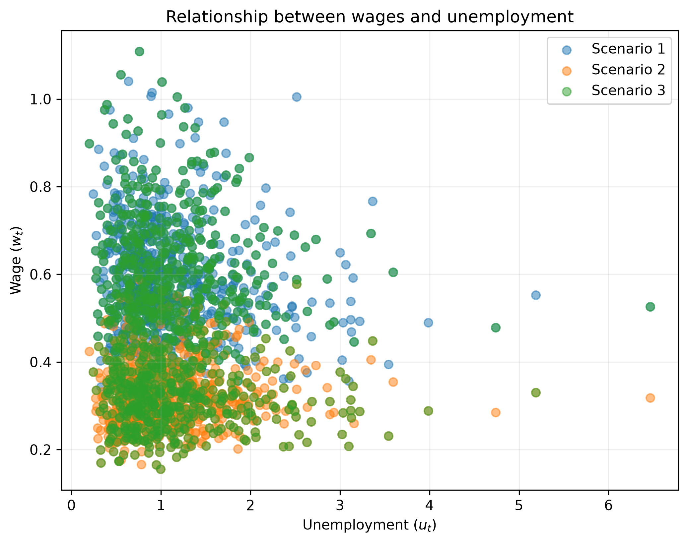

<!--
Render this document from the repository root with:

    quarto render pset_1/pset_1_submission.qmd --to pdf

The resulting PDF is written next to this file.
-->

# I. Conduct analysis in the product space: a monopsonist firm?

## Part 1: theory and DGP

### i. Solving for the equilibria

In scenario 1, the firm solves
$$
  \max_{L_t} p_t e^{\nu_t} L_t^\beta - w_t L_t,  
$$
with FOC
$$
  w_t = \beta\, p_t e^{\nu_t} L_t^{\beta - 1},
$$
which is the labor demand equation in this case. In scenario 2, where the firm knows it will affect wages, we also have to incorporate the $\partial w_t/\partial L_t$ term from the labor supply. The FOC in scenario 2 is
$$
  \beta\, p_t e^{\nu_t} L_t^{\beta - 1} = w_t + L_t\,\frac{\partial w_t}{\partial L_t}.
$$
We can already see that wages will be lower in this case. Because labor supply is upward-sloping in wages, the equation above will yield the wages of scenario 1 minus a positive term. Taking logs in the labor supply equation, we get
$$
\log (L_t) = \alpha + \gamma \log (w_t) + \mu \log (u_t) + \rho \log (u_t) \log (w_t) + \eta_t.
$$
This makes it easy to calculate the labor supply elasticity
$$
\frac{\partial\log(L_t)}{\partial\log(w_t)} = \frac{w_t}{L_t}\,\frac{\partial L_t}{\partial w_t} = \gamma + \rho \log(u_t).
$$
By the inverse function theorem,
$$
\frac{\partial\log(w_t)}{\partial\log(L_t)} = \frac{L_t}{w_t}\,\frac{\partial w_t}{\partial L_t} = \frac{1}{\gamma + \rho \log(u_t)}.
$$
Dividing both sides of the scenario 2 labor demand equation by $w_t$,
$$
  \frac{\beta\, p_t e^{\nu_t} L_t^{\beta - 1}}{w_t} = 1 + \frac{L_t}{w_t}\,\frac{\partial w_t}{\partial L_t} = 1 + \frac{1}{\gamma + \rho \log(u_t)}.
$$
Solving for $w_t$,
$$
w_t = \beta\,p_t e^{\nu_t} L_t^{\beta - 1} \tag{Scenario 1 Labor Demand}
$$
$$
w_t = \left(1 + \frac{1}{\gamma + \rho \log(u_t)}\right)^{-1} \beta\, p_t e^{\nu_t} L_t^{\beta - 1} \tag{Scenario 2 Labor Demand}.
$$
We can combine both by defining the markdown
$$
M = \begin{cases}
1, &\text{in Scenario 1}\\
\left(1 + \dfrac{1}{\gamma + \rho \log(u_t)}\right)^{-1}, &\text{in Scenario 2}
\end{cases}.
$$
Then, in both cases, labor market equilibrium $(L_t, w_t)$ is determined by both labor supply and demand, so by the system
$$
\begin{cases}
w_t = \beta\,M\, p_t e^{\nu_t} L_t^{\beta - 1}\\[0.5em]
L_t = \exp\Big(\alpha + \gamma \log (w_t) + \mu \log(u_t) + \rho \log(u_t)\log(w_t) + \eta_t\Big)
\end{cases}.
$$
If we knew all the parameters $(\beta, \alpha, \gamma, \mu, \rho)$, and we observed $(p_t, u_t, \nu_t, \eta_t)$, we would also know $M$. Hence, the only unknowns in the two equations would be $(L_t, w_t)$. We could solve for them by hand by substituting $w_t$ from the labor demand into the labor supply equation, from which we could find a root $L_t^*$. Then, we just plug it into either equation to compute $w_t^*$.

#### 1. Wages in Scenario 1 vs. in Scenario 2

Because the markdown term $M$ lies in $(0,1)$, the labor demand curve is shifted down in Scenario 2. Therefore, equilibrium wages will be lower in Scenario 2.

#### 2. Markdown

By the markdown formula
$$
M = \left(1 + \dfrac{1}{\gamma + \rho \log(u_t)}\right)^{-1},
$$
$M$ is increasing in $\gamma$, in $\rho$, and does not depend on $\mu$. It is also increasing in $u_t$. Because $M$ is a multiplier, $M$ becoming larger means that wages are being marked down less, hence higher. Here, we rely on $u_t > 1$ to avoid the logs being negative, so unemployment $u_t$ would be defined in absolute terms and not as a fraction.

### ii. Data generation

We generate $T=1000$ markets for each of the three scenarios using
$$
\theta=(\alpha,\gamma,\mu,\rho,\beta)=(0.5,0.8,0.2,0.1,0.6),
$$
with
$$
u_t\sim\operatorname{LogNormal}(0,0.5),
\qquad
p_t\sim\operatorname{LogNormal}(0,0.2),
$$
and
$$
\eta_t\sim N(0,0.1),
\qquad
\nu_t\sim N(0,0.2).
$$

All shocks are mutually independent.

The first five observations from each generated dataset are shown below.
See code for more.

| Scenario | $t$ | $w_t$ | $L_t$ | $u_t$ | $p_t$ |
|---:|---:|---:|---:|---:|---:|
| 1 | 1 | 0.7578 | 1.6031 | 2.1113 | 1.0817 |
| 1 | 2 | 0.5873 | 1.0659 | 0.9368 | 1.0050 |
| 1 | 3 | 0.7301 | 1.4357 | 1.3510 | 1.2463 |
| 1 | 4 | 0.6650 | 1.2546 | 1.1881 | 1.2983 |
| 1 | 5 | 0.5747 | 1.0984 | 1.0753 | 1.2478 |
| 2 | 1 | 0.4308 | 0.9782 | 2.1113 | 1.0817 |
| 2 | 2 | 0.3163 | 0.6522 | 0.9368 | 1.0050 |
| 2 | 3 | 0.4033 | 0.8772 | 1.3510 | 1.2463 |
| 2 | 4 | 0.3642 | 0.7669 | 1.1881 | 1.2983 |
| 2 | 5 | 0.3125 | 0.6717 | 1.0753 | 1.2478 |
| 3 | 1 | 0.4308 | 0.9782 | 2.1113 | 1.0817 |
| 3 | 2 | 0.5873 | 1.0659 | 0.9368 | 1.0050 |
| 3 | 3 | 0.4033 | 0.8772 | 1.3510 | 1.2463 |
| 3 | 4 | 0.3642 | 0.7669 | 1.1881 | 1.2983 |
| 3 | 5 | 0.5747 | 1.0984 | 1.0753 | 1.2478 |

: First five observations of the generated datasets {#tbl-datasets}

### iii. Wage and unemployment

@fig-wage-unemployment compares the relationship between wages and unemployment
across the three scenarios.

{#fig-wage-unemployment width=70% fig-pos="H"}

@fig-wage-unemployment shows that wages are generally higher in Scenario 1 than in
Scenario 2. This is consistent with the theoretical prediction from Part 1(i): under wage-taking,
firms take the wage as given and hire until the marginal revenue product of labor equals the wage,
whereas monopsonistic firms internalize the effect of their hiring decisions on wages and
therefore choose a lower wage. Scenario 3 combines the two types of firms with equal probability,
and consequently displays a mixture of the wage distributions observed in Scenarios 1 and 2.

The relationship between unemployment and wages is negative but noisy in the raw data. Holding
the other shocks constant, higher unemployment shifts labor supply outward and therefore tends to
reduce wages, as predicted in Part 1(i.2). This negative relationship is visible more clearly at
the extremes of the distribution, although the substantial dispersion reflects variation in the
other market-level shocks.

## Part 2: Estimation

We estimate the structural parameters using the three datasets generated in Part 1. Under Assumption 1,
$$
E[\eta_t,\nu_t\mid u_t,p_t]=0.
$$

**Moment conditions and instruments.**

We use the instrument vector
$$
Z_t=
\begin{pmatrix}
1\\
\log u_t\\
\log p_t
\end{pmatrix}.
$$

The conditional mean restriction implies that, for any function of $(u_t,p_t)$,
$$
E[\eta_t g(u_t,p_t)]=0
\qquad\text{and}\qquad
E[\nu_t g(u_t,p_t)]=0.
$$

Using the three instruments in $Z_t$ gives three moment conditions for each structural error:
$$
E[Z_t\eta_t]=0
\qquad\text{and}\qquad
E[Z_t\nu_t]=0.
$$

Thus, each estimation in Parts 2(i) and 2(ii) uses six moment conditions to estimate the five parameters
$$
\theta=(\alpha,\gamma,\mu,\rho,\beta).
$$
The models are therefore overidentified.

In Part 2(iii), we additionally estimate the conduct parameter $\omega$, so that the parameter vector becomes
$$
(\alpha,\gamma,\mu,\rho,\beta,\omega).
$$
The same six moment conditions are then used to estimate six parameters, making the model exactly identified.

**Parameter bounds.**

To avoid numerical instability during optimization and restrict the search to economically admissible values, we use the same bounds across the three estimation exercises:
$$
\begin{aligned}
-5 &\leq \alpha \leq 5,\\
0.01 &\leq \gamma \leq 5,\\
-5 &\leq \mu \leq 5,\\
-1 &\leq \rho \leq 1,\\
0.01 &\leq \beta \leq 0.99.
\end{aligned}
$$

For Part 2(iii), we additionally impose
$$
0\leq\omega\leq1,
$$
where $\omega=0$ corresponds to wage-taking and $\omega=1$ corresponds to monopsony.

### i. Estimation under monopsony

Under Assumption 2a, the firm behaves as a monopsonist. The GMM estimator uses the six moment
conditions implied by Assumption 1 and the monopsony first-order condition.

| Parameter | Scenario 1 | Scenario 2 | Scenario 3 |
|:--|--:|--:|--:|
| $\alpha$ | 0.8452 | 0.4965 | 0.5562 |
| $\gamma$ | 1.442 | 0.7957 | 0.8662 |
| $\mu$ | 0.1127 | 0.2109 | 0.1120 |
| $\rho$ | -0.1316 | 0.1040 | -0.01284 |
| $\beta$ | 0.9900 | 0.6038 | 0.9224 |
| GMM objective | 0.0004110 | $9.795\times10^{-8}$ | $2.200\times10^{-5}$ |
| Function evaluations | 38 | 62 | 42 |
| Gradient evaluations | 38 | 62 | 42 |
| Converged | Yes | Yes | Yes |

: GMM estimates under the monopsony assumption {#tbl-gmm-monopsony}

**Discussion.**
The estimates under the monopsony assumption are closest to the true parameter values in Scenario 2, which is the dataset generated under monopsony. Scenario 3 generally produces intermediate estimates, consistent with the fact that it combines wage-taking and monopsonistic markets with equal probability. The GMM objective is also substantially smaller in Scenario 2, indicating a better fit of the monopsony specification.

### ii. Estimation under wage-taking

Under Assumption 2b, the firm behaves as a price-taker (or wage-taker). The GMM estimator
again uses the six moment conditions, but the firm's first-order condition is now
$$
p_t\beta e^{\nu_t}L_t^{\beta-1}=w_t.
$$

| Parameter | Scenario 1 | Scenario 2 | Scenario 3 |
|:--|--:|--:|--:|
| $\alpha$ | 0.5101 | 0.5154 | 0.5203 |
| $\gamma$ | 0.8097 | 0.8137 | 0.8198 |
| $\mu$ | 0.3563 | 0.6257 | 0.5076 |
| $\rho$ | 0.3744 | 0.4609 | 0.4543 |
| $\beta$ | 0.6009 | 0.2276 | 0.3910 |
| GMM objective | $9.803\times10^{-7}$ | 0.0008740 | 0.0002060 |
| Function evaluations | 22 | 25 | 30 |
| Gradient evaluations | 22 | 25 | 30 |
| Converged | Yes | Yes | Yes |

: GMM estimates under the wage-taking assumption {#tbl-gmm-wagetaking}

**Discussion.**
Under the wage-taking assumption, the estimates are closest to the true parameter values in Scenario 1, which is the dataset generated under wage-taking. As in Part 2(i), Scenario 3 generally produces intermediate estimates because it combines the two types of firms. The GMM objective is also smallest in Scenario 1, consistent with the wage-taking specification fitting the data best when that is the true conduct.

### iii. Estimation with a conduct parameter

Under Assumption 1 alone, we introduce a conduct parameter $\omega$ that nests the two
behavioral assumptions:
$$
R_t'(L_t)
=
w_t+\omega L_t\frac{dw_t}{dL_t}.
$$

Thus,
$$
\omega=0
\quad\Longrightarrow\quad
\text{wage-taking},
$$
while
$$
\omega=1
\quad\Longrightarrow\quad
\text{monopsony}.
$$

The estimator therefore jointly estimates
$$
(\alpha,\gamma,\mu,\rho,\beta,\omega).
$$

| Parameter | Scenario 1 | Scenario 2 | Scenario 3 |
|:--|--:|--:|--:|
| $\alpha$ | 0.5000 | 0.4870 | 0.4972 |
| $\gamma$ | 0.7985 | 0.7875 | 0.7957 |
| $\mu$ | 0.1799 | 0.2085 | 0.1345 |
| $\rho$ | 0.05182 | 0.1020 | 0.01578 |
| $\beta$ | 0.6177 | 0.6085 | 0.7538 |
| $\omega$ | 0.02316 | 1.000 | 0.6459 |
| GMM objective | $7.243\times10^{-10}$ | $1.645\times10^{-7}$ | $2.703\times10^{-10}$ |
| Function evaluations | 48 | 108 | 67 |
| Gradient evaluations | 48 | 108 | 67 |
| Converged | Yes | Yes | Yes |

: GMM estimates with estimated firm conduct {#tbl-gmm-conduct}

**Discussion.**
The estimated conduct parameter $\omega$ closely reflects the underlying firm behavior. It is close to zero in Scenario 1, where firms are wage-takers, equal to one in Scenario 2, where firms are monopsonists, and around 0.6 in Scenario 3, which combines the two types of firms with equal probability.
The estimates of the remaining structural parameters are also more similar across scenarios and generally closer to their true values than under the restricted specifications in Parts 2(i) and 2(ii). This is intuitive because conduct is now estimated rather than imposed, allowing $\omega$ to capture differences in firms' behavior across markets rather than forcing the other structural parameters to absorb the misspecification.

# II. Demand systems for bikes?

## Part 1: theory and DGP
### i. Derive expression for share of consumers

Each consumer $i$, when consuming bike $j$, obtains utility
$$
U_{ij}=\exp\Big(\beta_w w_j + \beta_g g_j\Big) - \alpha_i p_j,
$$
where $\alpha_i\overset{i.i.d.}{\sim}\operatorname{LogNormal}(\mu,1)$

The probability that consumer $i$ chooses bike $j$ is typically
$$
  P_{ij} = P\Big\{U_{ij} \geq U_{ik}\quad\forall k\Big\}.
$$
But, because there is no consumer-good idyosyncratic term, there can be ties with non-zero probability. This is very similar to the Bresnahan vertical differentiation model, but with heterogeneity in $\alpha_i$ that multiplies prices, instead of the $v_i$ that multiplies qualities. To deal with this, we will reduce the good characterics into a single measure of quality, which is all that matters for decision-making. Define the quality of good $j$ as
$$
  q_j = \exp\Big(\beta_w w_j + \beta_g g_j\Big).  
$$
Then the utility obtained when consuming good $j$ is $U_{ij} = q_j - \alpha_i p_j.$ The consumer chooses from a menu of $(q_j, p_j)$ to maximize utility, depending on $\alpha_i$. Without loss of generality, we can reorder goods using $q_1 \leq q_2 \leq \dots \leq q_J$, with the possibility of ties. 

If there is a tie between goods $j$ and $j+1$, where $q_j = q_{j+1}$, one of two things will occur. The first case is $p_j = p_{j+1}$, and both are equally good choices for the consumer. In this case, we assume the consumer will flip a coin to pick each with 50\% probability. If there is a perfect tie between $k$ goods, the consumer may pick each with probability $1/k$. The second case is that $p_j \neq p_{j+1}$, so we can assume $p_j < p_{j+1}$ WLOG. But then, $U_{i,j} > U_{i, j+1}$ for all consumers $i$, meaning that good $j+1$ is strictly dominated. As no one will choose it, it will have zero market share. Our approach is that, in case of a perfect tie, we remove all but one of the options from the choice set. The remaining good is representative of all duplicates combined.

In general, any good $k$ is strictly dominated by $j$ if $(q_k, -p_k) \leq (q_j, p_j)$, element-by-element, and they are not exactly equal. We can safely remove strictly dominated goods from our menu. Since we are removing ties, this already implies that both qualities and prices much go in the same direction. We can arrange the remaining goods such that $q_1 < q_2 < \dots$ and $p_1 < p_2 < \dots$. Even more strongly, assume three consecutive goods $j$, $j+1$, and $j+2$, have
$$
\frac{q_{j+1} - q_j}{p_{j+1} - p_j} \leq \frac{q_{j+2} - q_{j+1}}{p_{j+2} - p_{j+1}}.
$$
We will show that almost no consumer will pick good $j+1$. Assume consumer $i$ chooses $j+1$. Then, he prefers it to both $j$ and $j+2$, meaning $q_{j+1} - \alpha_i p_{j+1} \geq q_{j} - \alpha_i p_{j}$. Rearranging,
$$
  \alpha_i \leq \frac{q_{j+1} - q_j}{p_{j+1} - p_j}.
$$
Doing the same for $j+1$ and $j+2$, as $q_{j+1} - \alpha_i p_{j+1} \geq q_{j+2} - \alpha_i p_{j+2}$, then
$$
  \alpha_i \geq \frac{q_{j+2} - q_{j+1}}{p_{j+2} - p_{j+1}}.
$$
Combining the two, this implies
$$
\frac{q_{j+2} - q_{j+1}}{p_{j+2} - p_{j+1}} \leq \alpha_i \leq \frac{q_{j+1} - q_j}{p_{j+1} - p_j}.
$$
Along with our initial assumption that the ratios are actually increasing, the only way both can be true is if $\alpha$ is exactly equal to both ratios. Because this happens with zero probability, removing goods like $j+1$ also will not affect choice probabilities (almost everywhere), and will therefore not change market shares. This means that there is no loss to imposing the assumption
$$
\frac{q_{j+1} - q_j}{p_{j+1} - p_j} > \frac{q_{j+2} - q_{j+1}}{p_{j+2} - p_{j+1}}.
$$

Therefore, we construct a reduced menu $\widetilde{C}$ of available pairs $(q_j, -p_j)$. Because we are only looking at a set of $(q, -p)$ choices and not individual goods, there are no perfect ties by construction. We also rule out strict dominance by removing goods $j$ such that $(q_j, -p_j) \leq (q_k, -p_k)$ for some $k\neq j$. Goods are then places in a stricly increasing order of both quality and prices. Finaly, we remove the possibility of increasing slopes by, given this ordering, removing any good $j+1$ such that
$$
\frac{q_{j+1} - q_j}{p_{j+1} - p_j} \leq \frac{q_{j+2} - q_{j+1}}{p_{j+2} - p_{j+1}}.
$$
This is done iteratively: we order the goods and compute the slopes. Then, we remove any non-increasing slopes, reassign the order and repeat. When choosing from this menu, consumers will have a unique best choice with probability 1. To see why, assume a consumer is indifferent between $(q, -p)$ and $(q', -p')$. Then, $q - \alpha_i p = q' - \alpha_i p'$, which pins down a particular value for $\alpha_i = (q'-q)/(p'-p)$, which happens with zero probability, by the distribution of $\alpha_i$. Also, the choice will never be empty: as they choose from a finite list of real numbers, one of them must be the highest. This means that, when integrating choice probabilities into market shares, we do not need to worry about multiplicity of choices.

Order the choices in $\widetilde{C}$ by quality, with $q_1 < q_2 < \dots < q_{\widetilde{J}}$. By construction, the same order applies to prices, $p_1 < p_2 < \dots < p_{\widetilde{J}}$, and to slopes. Finally, we can compute choice probabilities. Individual $i$ chooses $j$ if, and only if, $q_j - \alpha_i p_j \geq q_k - \alpha_i p_k$ for all pairs $(q_k, -p_j) \in \widetilde{C}$. But we can simplify the expression by only looking at neighbors, as in the Bresnahan vertical differentiation model, thanks to the decreasing slopes restriction.

Individual $i$ prefers good $j$ over $j+1$ when $q_j - \alpha_i p_j \geq q_{j+1} - \alpha_i p_{j+1}$. Assume, by contradiction, that he prefers good $j+2$ over $j$, so $q_j - \alpha_i p_j \leq q_{j+2} - \alpha_i p_{j+2}$. These two imply
$$
\frac{q_{j+1} - q_j}{p_{j+1} - p_j} \leq \alpha_i \leq \frac{q_{j+2} - q_j}{p_{j+2} - p_j},
$$
Which is impossible in our menu $\widetilde{C}$ by construction. As a result, if a consumer prefers $j$ over $j+1$, they will also prefer $j$ over $j+2$, and so on. Symmetrically, if he prefers $j$ over $j-1$, he will also prefer $j$ over all lower goods. Because of this, preferring $j$ to both neighbors is equivalent to $j$ being the global optimum. The probability that individual $i$ chooses $j$ is
\begin{align*}
P_{ij} &= P\Big\{\text{$i$ prefers $j$ to $j+1$ and to $j-1$}\Big\}\\
&= P\Big\{q_j - \alpha_i p_j \geq q_{j+1} - \alpha_i p_{j+1},\quad q_j - \alpha_i p_{j}\geq q_{j-1} - \alpha_i p_{j-1}\Big\}\\
&=P\left\{\frac{q_{j+1} - q_j}{p_{j+1} - p_j} \leq \alpha_i \leq \frac{q_j - q_{j-1}}{p_j - p_{j-1}}\right\}.
\end{align*}
For a given consumer that observes his $\alpha_i$, this expression is either 0 or 1. In knife-edge cases where a consumer falls exactly at the margin, this would predict that they could choose more than one good. But this occurs with zero probability, so when we aggregate, each pair $(q_j, -p_j)$ in $\widetilde{C}$ will have market share
$$
  s(q_j, -p_j) = \int_0^\infty \mathbb{I}\left[\frac{q_{j+1} - q_j}{p_{j+1} - p_j} \leq \alpha \leq \frac{q_j - q_{j-1}}{p_j - p_{j-1}}\right]\,\mathrm{d}F(\alpha)\\
  = F\left(\frac{q_j - q_{j-1}}{p_j - p_{j-1}}\right) - F\left(\frac{q_{j+1} - q_j}{p_{j+1} - p_j}\right),
$$
where $F$ is the cdf of $\alpha_i$. Define $\text{ties}_j$ equal to the number of goods exactly tied in both quality and price with good $j$, including $j$. If $j$ has no ties, $\text{ties}_j = 1$. To summarize, the market share of a good $j$ is
$$
  s_j = \frac{s(q_j, -p_j)}{\text{ties}_j},\text{ if $(q_j, -p_j) \in \widetilde{C}$},\quad\text{and $0$ otherwise}.
$$
For the worst good to have a well-defined market share, there is also the outside option of not buying anything, with $q_0 = p_0 = 0$. And for the best good, everyone with low enough $\alpha_i$ purchases it, so that its market share is $F(\dots)$, only with the first term.

\pagebreak

### ii. Bertrand-Nash price equilibrium

On the supply side, we assume a static multi product Bertrand-Nash game. Alan and Bianchi choose prices simultaneously, each taking the rival firm's prices as given. Product characteristics and marginal costs are taken as given, and each firm chooses the prices of all products it owns to maximize its total profit.

Alan owns $\mathcal J_A=\{a_1,a_2,a_3\}$ and Bianchi owns $\mathcal J_B=\{b_1,b_2\}$. Firm $f$'s profit in time $t$ is
$$
\pi_{ft}=\sum_{k\in\mathcal J_f}(p_{kt}-mc_{kt})s_{kt}(\mathbf p_t).
$$
Assuming an interior equilibrium and differentiable demand, the FOC for each $j\in\mathcal J_f$ is
$$
s_{jt}+\sum_{k\in\mathcal J_f}(p_{kt}-mc_{kt})\frac{\partial s_{kt}}{\partial p_{jt}}=0.
$$
To write these FOCs compactly, define the ownership matrix
$$
\Omega_{kj}
=
\begin{cases}
1, & \text{if products }k\text{ and }j\text{ are owned by the same firm},\\
0, & \text{otherwise}.
\end{cases}
$$
Here,

$$
\Omega
=
\begin{pmatrix}
1&1&1&0&0\\
1&1&1&0&0\\
1&1&1&0&0\\
0&0&0&1&1\\
0&0&0&1&1
\end{pmatrix}.
$$

Thus $\Omega$ simply tells the model which cross price effects a firm internalizes. Alan internalizes the effects of changing one Alan price on all three Alan products, while Bianchi does the same for its two products. Neither firm internalizes the effect of its pricing decision on the rival firm's profit. We define
$$
D_t=\left[\frac{\partial s_{kt}}{\partial p_{jt}}\right]_{k,j}
$$

as the demand Jacobian. Then the five Bertrand first order conditions can be written as

$$
\mathbf s_t+(\Omega\circ D_t)'(\mathbf p_t-\mathbf{mc}_t)=\mathbf 0,
$$

where $\circ$ is the elementwise product. Defining

$$
\Delta_t=-(\Omega\circ D_t)',
$$

gives

$$
\mathbf s_t-\Delta_t(\mathbf p_t-\mathbf{mc}_t)=\mathbf 0.
$$

If $\Delta_t$ is invertible,
$$
\mathbf p_t-\mathbf{mc}_t=\Delta_t^{-1}\mathbf s_t.
$$

### iii. Product positioning and marginal costs

Again, we use the definition of quality as $q_j = \exp\Big(\beta_w w_j + \beta_g g_j\Big)$, with the parameter values from the question. Also plugging in the marginal cost functions from the question,

{#fig-product-positioning width=100%}

Note that for $t=1$, $a_2$ and $b_1$ coincide as they have the same marginal cost. Also, we see that marginal cost rises over time for every product except $a_3$, because $w_{a_3}=1$ makes its carbon cost component equal to zero.

### iv. Brief comment on market shares and competition

Product characteristics, and therefore quality, are fixed over time. The change in relative positioning therefore comes from marginal costs:

$$
\Delta MC_j=\gamma_w(1-w_j)(c_{10}-c_1)=0.225(1-w_j).
$$

Hence,

$$
(\Delta MC_{a_1},\Delta MC_{a_2},\Delta MC_{a_3},\Delta MC_{b_1},\Delta MC_{b_2})=(0.1575,0.2025,0,0.1575,0.1125).
$$

We expect $a_3$ to gain market share because its marginal cost does not increase. $b_2$ should also gain relative to products whose costs rise more, while $a_2$, which has the largest cost increase, should lose.

The comparison between $a_2$ and $b_1$ is clear as they have identical quality (same value on x-axis), but by $t=10$,

$$
MC_{a_2,10}=0.9075>0.8625=MC_{b_1,10},
$$

so $b_1$ gains a cost advantage over $a_2$, and can try to bring prices down until $a_2$ is out of the market. Meanwhile, we see in the graph that the marginal costs of $b_2$ and $a_3$ become closer, such that $b_2$ should lose some competitive edge against $a_3$, as they produce similar quality goods.

### v. Bertrand NE for different $\mu$

Calling the function that stacks all market shares $D(\mathbf{p}_t; \mu)$, we can substitute into the Bertrand-Nash FOC to have the equilibrium condition
$$
  D(\mathbf{p}_t; \mu) = \Delta_t(\mathbf p_t-\mathbf{mc}_t)
$$
We can either solve for $\mathbf p_t$ and try to iterate until we find a fixed point, or just directly look for a root of the equation. But we run into a couple of problems related to ties if we try these.

First, if two firms produce goods with the exact same quality and marginal cost, the market share functions will be discontinuous in prices, and it will be difficult to find a solution because they'll be incentivised to undercut each other, and prices may jump around without converging. We can also not simply drop one of the goods, because that would change the jacobian and one of the firms would ignore the effects that their version of the good has. To deal with this, we impose the following assumption: if two different firms produce goods that are identical in both quality and marginal cost, they will then have directly Bertrand competition among them, such that both of them will price the good at $p_{jt} = \text{mc}_{jt}$ and equally split the market.

The second thing that causes problems is when different firms produce goods that are the same quality, but with differing marginal costs. Assume that happens for a good with $\text{mc}_A < \text{mc}_B$, for example. Firm $A$ is able to undercut until firm $B$ is out of the market, with $p = \text{mc}_B$. The problem is that, then, the best response of firm A is to price at its monopoly price. It may be the case that this new price will be above $\text{mc}_B$, incentivising firm $B$ to rejoin the market. In this case, no Bertrand-Nash Equilibrium exists. The assumption we make is: if two firms produce the same quality good with $\text{mc}_A < \text{mc}_B$, then we remove firm B from the market. This can be interpreted as some entry cost that prevents firm B from reentering to compete again, even if prices are high enough.

To compute the equilibria, we start from a guess of which subset of goods are active, and an initial price vector with $p_j = q_j^2$, which guarantees that the slopes follow a decreasing order. Then, the code removes goods that are strictly dominated and deals with ties as we assumed above (it also checks if there are nondecreasing slopes). Then, we reduce the dimension of the problem to only non-dominated good that do not tie, in hopes that demand will be smooth. To search for the equilibrium, we use a least squares solver to find the price vector that minimizes the error in FOCs, looking only at the goods that remain in the market. As some of the prices are held fixed at some $\text{mc}_j$ and some goods are eliminated from the start, this is a sort of partial equilibrium between the remaining ones.

Most of the time, this algorithm finds an equilibrium (very small deviations in FOCs of non-eliminated firms), but not always, in which case we still keep the smallest deviations the solver could find.

Below, as an example, are the market shares computed between times 1 and 10, for the case $\mu = 0$.

{#fig-market-shares width=85%}

And the full datasets are in the `/output/` folder

[Bertrand results: $\mu=-0.5$](output/bikes_1.csv)  
[Bertrand results: $\mu=0$](output/bikes_2.csv)  
[Bertrand results: $\mu=0.5$](output/bikes_3.csv)

### vi. Coordination in $a_2$ and $b_1$ prices

Here Alan choose $p_{a_1}$ and $p_{a_3}$ to maximize $\pi_A$, Bianchi choose $p_{b_2}$ to maximize $\pi_B$, and the pair $(p_{a_2},p_{b_1})$is chosen jointly to maximize total industry profit $\pi_A+\pi_B$ holding the other prices fixed. Thus the game has three price setting decision makers: Alan's noncoordinated products, Bianchi's noncoordinated product, and the coordinated $(a_2,b_1)$ pair. We iterate these three best responses and verify that no decision maker has a profitable deviation. The agreement is valuable because $\delta_{a_2}=\delta_{b_1}.$

The two products have the same deterministic quality and, at $t=1$, the same marginal cost, so they are very close substitutes. Under competition, cutting the price of one steals demand from the other. Coordinating their prices lets the firms take this effect into considerations and reduces the incentive to undercut each other.

Under collusion, it looks a lot more stable

{#fig-market-shares-collusion width=85%}

And full datasets are

[Collusion results: $\mu=-0.5$](output/bikes_collusion_1.csv)  
[Collusion results: $\mu=0$](output/bikes_collusion_2.csv)  
[Collusion results: $\mu=0.5$](output/bikes_collusion_3.csv)

\pagebreak

## Part 2: Estimation

### i. Estimator

We define
$$
\theta_d=(\mu,\beta_w,\beta_g).
$$

The variance of $\log\alpha_i$ remains fixed at one, as specified in the DGP, so only $\mu$ is estimated from the distribution of price sensitivity.

For a given $\theta_d$, predicted product shares are
$$
s_{jt}(\theta_d)=\int\frac{\exp(\delta_j-\alpha p_{jt})}{\sum_k\exp(\delta_k-\alpha p_{kt})}f_\alpha(\alpha;\mu)\,d\alpha,
$$

with same as above
$$
\delta_j=\exp(\beta_w w_j+\beta_g g_j).
$$

Because market size is normalized to one, the observed $q_{jt}$ are market shares and satisfy $\sum_jq_{jt}=1$. We therefore use them as choice frequencies. The multinomial log likelihood per consumer in market $t$ is
$$
\ell_t(\theta_d)=\sum_jq_{jt}\log s_{jt}(\theta_d).
$$

The demand estimator is

$$
\hat\theta_d=\arg\max_{\theta_d}\sum_{t=1}^{10}\ell_t(\theta_d).
$$

Following the provided JAX structure, we write the likelihood for one market and use `vmap` to apply it to all 10 markets.
For the supply side, we impose the competitive Bertrand ownership structure from Part 1(ii). Let

$$
D_t=\left[\frac{\partial s_{kt}}{\partial p_{jt}}\right]_{k,j}
$$

evaluated at $\hat\theta_d$ and the observed prices, and define

$$
\hat\Delta_t=-(\Omega\circ D_t)'.
$$

The Bertrand FOCs imply
$$
\mathbf q_t-\hat\Delta_t(\mathbf p_t-\mathbf{mc}_t)=\mathbf 0,
$$

so implied marginal costs are
$$
\widehat{\mathbf{mc}}_t=\mathbf p_t-\hat\Delta_t^{-1}\mathbf q_t.
$$

Finally, the structural cost equation is

$$
MC_{jt}=\gamma_w(1-w_j)c_t+\gamma_g g_j.
$$

It contains no intercept, so we estimate $(\gamma_w,\gamma_g)$ by OLS without a constant:
$$
(\hat\gamma_w,\hat\gamma_g)
=
\arg\min_{\gamma_w,\gamma_g}
\sum_{t,j}
\left[
\widehat{MC}_{jt}
-
\gamma_w(1-w_j)c_t
-
\gamma_g g_j
\right]^2.
$$

### ii. Estimation results

The estimates are

| Dataset | $\hat\mu$ | $\hat\beta_w$ | $\hat\beta_g$ | $\hat\gamma_w$ | $\hat\gamma_g$ |
|---|---:|---:|---:|---:|---:|
| Competition 1 | -0.5000 | -0.1000 | 0.2000 | 0.2500 | 0.3000 |
| Competition 2 | 0.0000 | -0.1000 | 0.2000 | 0.2500 | 0.3000 |
| Competition 3 | 0.5000 | -0.1000 | 0.2000 | 0.2500 | 0.3000 |
| Collusion 1 | -0.5000 | -0.1000 | 0.2000 | 1.6603 | 0.2106 |
| Collusion 2 | 0.0000 | -0.1000 | 0.2000 | 1.1025 | 0.2480 |
| Collusion 3 | 0.5000 | -0.1000 | 0.2000 | 0.7660 | 0.2724 |

For the competitive datasets, the estimator gets all five parameters almost exactly right, which is expected since the estimation model matches how these datasets were generated.
For the collusive datasets, the demand estimates $\hat\mu,\hat\beta_w,$ and $\hat\beta_g$ barely change. The reason is that collusion changes how firms set prices, but not how consumers choose among products.
The cost estimates are different. Here the estimator still assumes Bertrand competition even though $a_2$ and $b_1$ were priced jointly, so part of the collusive markup is incorrectly obsorbed into marginal cost. This is why $\hat\gamma_w$ is much larger than the true value $0.25$. The distortion becomes smaller as $\mu$ increases: $\hat\gamma_w$ falls from about $1.66$ to $0.77$, while $\hat\gamma_g$ moves closer to $0.30$. This pattern comes from these simulated datasets and is not a general feature of collusion.

## Part 3: Extra and optional

### i. Households choosing multiple bikes

Let household $h$ have $n_h\in\{1,\ldots,5\}$ members. We assume that each member can buy at most one bike, so the household chooses a bundle

$$\mathbf q_h=(q_{ha_1},\ldots,q_{hb_2}), \qquad q_{hj}\in\mathbb Z_+, \qquad \sum_j q_{hj}\le n_h.$$

We model the household's utility as the sum of the utilities from all bikes it buys:

$$U_h(\mathbf q)=\sum_j q_j\delta_j-\alpha_h\sum_j p_jq_j+\epsilon_{h\mathbf q},$$

where $\alpha_h\sim\operatorname{LogNormal}(\mu,1)$ and $\epsilon_{h\mathbf q}$ is i.i.d. Type-I extreme value across possible bundles. So, conditional on $\alpha_h$, the household chooses among bundles using the same logit idea as before.

If $\lambda_n$ is the fraction of households with $n$ members, demand for product $j$ is

$$Q_j(\mathbf p)=\sum_{n=1}^5\lambda_n\sum_{\mathbf q\in\mathcal B_n}q_jP(\mathbf q\mid n).$$

The main difference from Part 1 is that $Q_j$ is now the expected number of bikes purchased, rather than the fraction of consumers choosing product $j$, because one household can buy more than one bike.

On the supply side, we keep the same Bertrand pricing setup, but replace $s_j$ and its price derivatives with $Q_j$ and its derivatives.

For estimation, if we observe household size and the bundle each household chooses, we can estimate demand from those bundle choices, again integrating over $\alpha_h$. We then recover marginal costs using the new quantity demand Jacobian and estimate $(\gamma_w,\gamma_g)$ as in Part 2. If we only observe aggregate product quantities, we would instead match predicted and observed quantities using minimum distance or GMM.